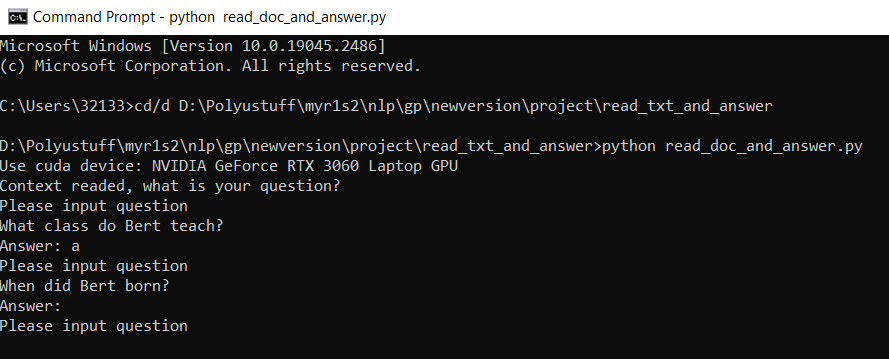

# Fine-tune-BERT-base-uncased-QA-SQuAD2.0
Fine tune bert-base-uncased for Queation answering on SQuAD 2.0 by using BERT transofrmers

This set of program is written by referencing to some online sources like code templates, previous works by orders, documents etc., without them we probably not able to write this.

# Index 
### [What is inside the folder](# What is inside the folder)
### [The structure of the QA system](# The structure of the QA system)
### [Performance and link to trained model](# Performance and link to trained model)
### [light weight program for reading comprehension answering](# light weight program for reading comprehension answering)
### [How to use (Detailed description)](# How to use (Detailed description))
### [Requirement](# Requirement)
### [Reference](# Reference)

# What is inside the folder
This repository consisted of few things which is in each folder. Their name should already imply what they do. 
1. Training for bert Question and answering, from fine-tuing bert-base-uncased. 
They are in "train_bert_base_qa" folder. They are designed to run at colab. The model is trained at a a100 in colab. We trained for 4 epoch, batch size=32.

2. Training for aswerable/unaswerable classifier, which is also fine tuned from bert-base-uncased, it also test its accuracy on SQuAD2.0 dev set for classifier if question is aswerable/unaswerable. 
They are in "answerable_classifier" folder. They are designed to run at colab. The model is trained at a a100 in colab. We trained for 4 epoch, batch size=32.

3. Code for test the system on SQuAD2.0 dev set and give the respective .json output. 
They are in "combined" folder. ipynb file.

4. A light weight program for the model to gives answer from a given context. 
They are in "read_txt_and_answer" folder. It is a python program, which can run on cuda device or cpu.

5. Program to convert .json dataset into .csv for the data needed in different part of the program. The dataset is in .json originally, but for easiler programing, it had been converted into .csv and is used in some of the program. These programs in in these folder in the respective program need it, they are named by convert_json_to_csv... something like this their name imply what they converted.

# The structure of the QA system
The QA program use two models, first is for the BERT Question answering, another one is for BERT classifier, which is for classifiering answerable and unanswerable question. For overall structure and for of how the QA program work, see below:
   

# Performance and link to trained model
We had tested the system on the dev set, at epoch 4 on both classifier and bert QA: 
Exact Match (EM): 53.0784 
f1: 59.1615 

On the classifier alone, it can get 72.6899% of accuracy for classifing answerable and unanswerable question.  
On the QA bert alone, The F1 is 32.7591, EM is 24.9474. In the system, we do not use [CLS] output for unanswerable question, since the QA bert alone has almost no ability to answer unanswerable question, which also leads to low f1 and EM. 

The model is uploaded to huggingface, Bert QA at https://huggingface.co/lrex93497/bert_qa_pt_3, Classifier at https://huggingface.co/lrex93497/bert_qa_classifier_pt_3
 
# light weight program for reading comprehension answering
The program is in "Read_txt_and_answer" folder. Before use, please modify values "model_qa" and "classifier_model" inside the .py file to the respective models location. Enter the context into the "context.txt" file, only in the first line. Then run "read_doc_and_answer.py" to wait it ask you to input question. Then you can ask question, if it find answer, it answer the answer. But it determines there is no answer, it output "". You can keep asking questions once it is loaded. 

Belows is a example of running the program, using our trained model with context "Bert is a teacher, he teaches class a from Monday to Friday every week. Bert is an experienced teacher with 10 years of teaching experience.": 
   

# How to use (Detailed description)
Detailed description of how to every things in this respository is recorded in how_to_use.pdf .

# Requirement
Below is the package and python we had used:  
Python 	     3.7.9 
Cuda 11.3, may need to change accord to GPU  
datasets                2.10.1 
transformers            4.26.0.dev0 
pandas                  1.3.5 
numpy                   1.21.6 
matplotlib              3.5.3 
seaborn                 0.12.2 
sklearn                 0.0.post1 
torch                   1.12.1+cu113 
tqdm                    4.64.1 

# Reference
https://github.com/ThaddeusSegura/BERT_on_SQuAD/blob/master/SE_classification.ipynb  
https://www.kaggle.com/code/peymaanalavi/questionanswering-on-squad  
